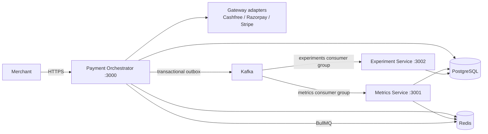
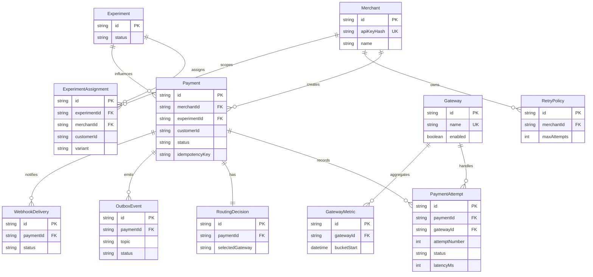
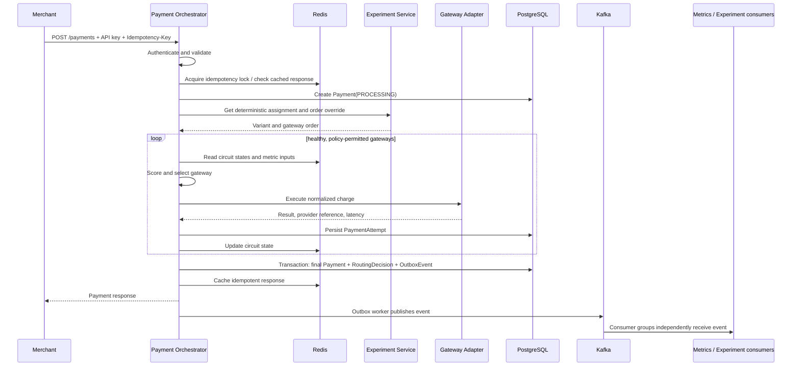

# Phase 1: Architecture

## Service boundaries



`payment-orchestrator` is the sole merchant-facing service and owns synchronous payment processing. `metrics-service` and `experiment-service` are asynchronous consumers; neither can delay or process a payment.

## Component responsibilities

| Component | Responsibility |
| --- | --- |
| Payment Orchestrator | Merchant authentication, validation, payment state, routing, attempts, retry/failover, circuit breakers, idempotency, outbox, verification, and webhooks |
| Gateway adapters | Provide a single normalized simulator interface for Cashfree, Razorpay, and Stripe |
| Metrics Service | Consume payment events; maintain Redis hot metrics and PostgreSQL minute aggregates |
| Experiment Service | Deterministic assignment, gateway-order overrides, lifecycle management, outcome statistics, and Thompson sampling |
| PostgreSQL | Durable business source of truth |
| Redis | Idempotency coordination, circuit state, hot metrics, and BullMQ state |
| Kafka | Independent asynchronous propagation of payment domain events |

## Data model



The later Prisma schema will enforce unique `(merchantId, idempotencyKey)` payment identity, unique merchant retry policies, and unique experiment assignment per experiment/customer. Indexes cover payment merchant/customer/status, payment attempts by payment/gateway/time, and outbox status/time.

## Event contracts

| Kafka topic | Producer | Consumers | Meaning |
| --- | --- | --- | --- |
| `payment.attempted` | Payment Orchestrator | Metrics Service | A gateway call was recorded |
| `payment.completed` | Payment Orchestrator | Metrics Service, Experiment Service | A payment reached success |
| `payment.failed` | Payment Orchestrator | Metrics Service, Experiment Service | A payment permanently failed |
| `payment.timeout` | Payment Orchestrator | Metrics Service, Experiment Service | A payment ended in timeout |

Each event carries an event id, occurred-at timestamp, correlation id, payment id, merchant id, gateway, method, status, attempt number where applicable, and latency where applicable. Consumers are idempotent by event id.

## Payment sequence



## Source layout

```text
services/
  payment-orchestrator/src/{adapters,config,constants,controllers,events,middlewares,queues,repositories,routes,services,strategies,utils,validators,workers}
  metrics-service/src/{config,consumers,controllers,repositories,services,workers}
  experiment-service/src/{config,consumers,controllers,repositories,services,workers}
shared/{config,constants,kafka,logger,redis}
prisma/
tests/{unit,integration}
docs/
```
